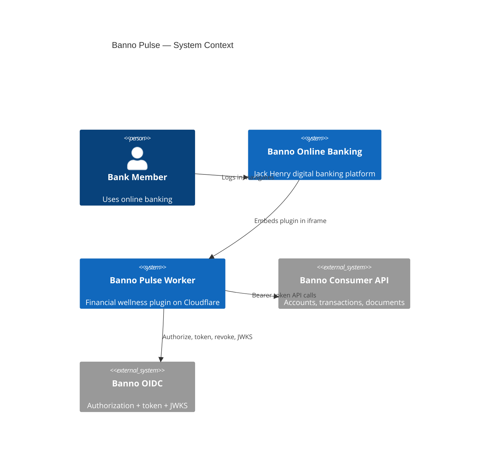
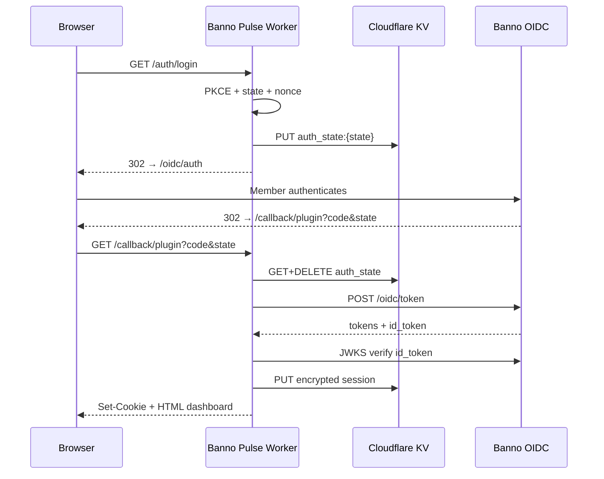

# Banno Pulse — Architecture

**Version:** 1.1.0  
**Last updated:** July 27, 2026  
**Runtime:** Cloudflare Workers (edge)  
**Framework:** Hono v4 with JSX server-side rendering  
**Related:** [security.md](./security.md) · [README.md](./README.md)

---

## Overview

Banno Pulse is a **financial wellness plugin** embedded in Banno Online Banking. It aggregates accounts, transactions, spending insights, savings goals, and documents into a unified dashboard — rendered server-side at the edge with no client-side application framework.

Members authenticate via **Banno OIDC** (OAuth 2.0 + PKCE + nonce). Financial data is fetched from the **Banno Consumer API** only on the Worker. Access tokens never reach the browser.

---

## System Context



---

## High-Level Architecture

```
┌─────────────────────────────────────────────────────────────────────────┐
│                        Banno Online Banking (HTTPS)                      │
│                     iframe src = Worker /callback/plugin                 │
└──────────────────────────────────┬──────────────────────────────────────┘
                                   │ OAuth redirect + iframe load
                                   ▼
┌─────────────────────────────────────────────────────────────────────────┐
│                    Cloudflare Worker — Banno Pulse                       │
│                                                                          │
│  ┌─────────────┐  ┌──────────────┐  ┌─────────────┐  ┌──────────────┐  │
│  │ Middleware  │  │ Route Layer  │  │  Services   │  │  JSX Views   │  │
│  │ Logger      │  │ auth.routes  │  │ auth        │  │ Dashboard    │  │
│  │ RequestId   │  │ page.routes  │  │ session     │  │ Accounts     │  │
│  │ Headers/CSP │  │ api.routes   │  │ banno       │  │ Transactions │  │
│  │ CORS/CSRF   │  │              │  │ goals       │  │ Insights     │  │
│  │ RateLimit   │  │              │  │ kv          │  │ Goals        │  │
│  └─────────────┘  └──────────────┘  └─────────────┘  └──────────────┘  │
│                                                                          │
│         ┌────────────────────┐         ┌────────────────────┐           │
│         │   Cloudflare KV    │         │   Cloudflare D1    │           │
│         │  (SESSIONS_KV)     │         │   (GOALS_DB)       │           │
│         │  OAuth state       │         │  savings_goals     │           │
│         │  Encrypted sessions│         │  (per user_id)     │           │
│         │  Rate limit counters│        │                    │           │
│         └────────────────────┘         └────────────────────┘           │
└─────────────────────────────────────────────────────────────────────────┘
                                   │
                                   ▼
                    ┌──────────────────────────────┐
                    │   Banno Platform (ENV_URI)   │
                    │  /oidc/auth · /oidc/token    │
                    │  /oidc/jwks · /oidc/revoke   │
                    │  /users/* Consumer API       │
                    └──────────────────────────────┘
```

---

## Component Breakdown

### Entry — `src/index.tsx`

Middleware order:

1. Logger  
2. Request ID (`X-Request-Id`)  
3. Security headers (HSTS, nosniff, referrer policy)  
4. Body limit (50 KB)  
5. CORS (hostname allowlist)  
6. Rate limit (`/auth/`, `/callback`, `/api/`) — fail closed  
7. CSRF (exempt `/auth/*`, `/callback*`)  
8. JSX renderer (`Layout`)  
9. CSP (including `frame-ancestors` + `upgrade-insecure-requests`)

Routes: auth → pages → API.  
`notFound` falls through to `ASSETS` for static files, then applies security headers.

---

### Routes

| Module | Paths | Role |
|--------|-------|------|
| `auth.routes.ts` | `/auth/login`, `/logout`, `/callback` | OAuth start, callback redirect, logout + revoke |
| `page.routes.tsx` | `/`, `/callback/plugin`, `/login`, `/dashboard` | Landing + iframe plugin UI |
| `api.routes.ts` | `/api/goals`, `/api/goals/:id/delete` | Goal mutations (`requireSession` + CSRF) |

#### Page routes

| Route | Auth | Description |
|-------|------|-------------|
| `GET /` | None | Landing with sign-in |
| `GET /login` | None | Redirect → `/auth/login` |
| `GET /callback/plugin` | Session **or** OAuth `code` | Iframe entry; handles callback inline |
| `GET /dashboard` | None | Redirect → `/callback/plugin` |

Tabs: `?tab={dashboard\|accounts\|transactions\|insights\|goals\|documents}` (allowlisted).

#### API routes

| Route | Method | Auth | CSRF |
|-------|--------|------|------|
| `/api/goals` | POST | `requireSession` | Yes |
| `/api/goals/:id/delete` | POST | `requireSession` | Yes |

---

### Services

#### `auth.service.ts`

- PKCE S256 + random `state` + `nonce`
- Stores `{ codeVerifier, nonce }` in KV (`auth_state:{state}`, 10 min)
- Token exchange / refresh with `client_secret`
- Refresh-token revocation via discovery `revocation_endpoint`
- Validates `REDIRECT_URI` before starting OAuth

**Scopes:** `openid`, `offline_access`, `profile`, accounts/user/documents/transactions readonly scopes, plus selected claim scopes.

#### `session.service.ts`

- Encrypted KV: `session:{id}`, `user_session:{userId}` (one session per user)
- Access-token refresh when `expiresAt` (Unix seconds) is past
- **Idle timeout:** 30 minutes via `lastActivityAt`
- **Absolute TTL:** 30 days

```typescript
{
  userId: string
  accessToken: string
  refreshToken: string
  expiresAt: number       // access token expiry, Unix seconds
  lastActivityAt: number  // idle tracking, Unix seconds
}
```

#### `kv.service.ts`

- AES-256-GCM; key = SHA-256(`SESSION_ENC_SECRET`)
- Wire format: `{base64_iv}:{base64_ciphertext}`
- No plaintext fallback when secrets are configured
- Optional multi-secret decrypt for rotation

#### `banno.service.ts`

| Method | Path |
|--------|------|
| `getUser` | `/users/{userId}` |
| `getAccounts` | `/users/{userId}/accounts` |
| `getTransactions` | `/users/{userId}/accounts/{accountId}/transactions` |
| `getDocuments` | `/users/{userId}/documents` |

`loadDashboardData()` fans out fetches, computes net worth / health score / spending categories. Upstream failures become opaque error codes — never raw API bodies in the UI.

#### `goals.service.ts`

Parameterized D1 CRUD. Limits: **50 goals/user**, amount ≤ **1e12**. Deletes always require matching `user_id`.

---

### Middleware — `auth.middleware.ts`

| Middleware | Role |
|------------|------|
| `requestId()` (`hono/request-id`) | UUID → context + `X-Request-Id` |
| `requireSession` | Cookie → decrypt session → set `userId` / `accessToken` |

`requireSession` is applied to all `/api/*` routes.

---

### Presentation

- **`layout.tsx`** — Landing shell vs app shell (tabs + logout)
- **`views.tsx`** — One SSR view per tab
- Dashboard tab views (`views.tsx`)

Navigation is plain `<a href>` (full page loads).

---

### Utilities

| Module | Purpose |
|--------|---------|
| `utils/auth.ts` | Callback → verify ID token → session + cookie |
| `utils/crypto.ts` | OIDC discovery, JWKS, ID token verify |
| `utils/origins.ts` | CORS/CSRF allowlists, redirect URI checks |
| `utils/errors.ts` | Safe client messages + structured logging |
| `utils/format.ts` | Currency, masking, categorization, health score |
| `utils/public-url.ts` | Localhost / Banno-embed detection |

---

## Authentication Flow



### Session cookie

| Attribute | Value |
|-----------|-------|
| Name | `__Secure-session_id` |
| Signing | `COOKIE_SIGNING_SECRET` |
| Encryption of payload | `SESSION_ENC_SECRET` (KV) |
| Flags | `httpOnly`, `secure`, `SameSite=None`, `Partitioned` |
| Idle / absolute | 30 min / 30 days |

---

## Request Lifecycle (Authenticated Tab)

```
GET /callback/plugin?tab=accounts
  │
  ├─ logger → requestId → security headers → bodyLimit
  ├─ CORS allowlist → rate limit (/callback) → CSRF skipped
  ├─ JSX renderer
  │
  ├─ Signed cookie → SessionService.getSession
  │     ├─ idle check → refresh access token if needed
  │     └─ touch lastActivityAt
  ├─ loadDashboardData(userId, accessToken)
  ├─ Render AccountsView
  ├─ Set CSP
  └─ text/html
```

---

## Data Model

### KV

| Key | Value | TTL |
|-----|-------|-----|
| `auth_state:{state}` | `{ codeVerifier, nonce }` encrypted | 10 min |
| `session:{sessionId}` | Session blob encrypted | 30 days |
| `user_session:{userId}` | `sessionId` encrypted | 30 days |
| `ratelimit:{prefix}:{ip}` | Counter | 60 s |

### D1 — `savings_goals`

```sql
CREATE TABLE savings_goals (
  id             TEXT PRIMARY KEY,
  user_id        TEXT NOT NULL,
  name           TEXT NOT NULL,
  target_amount  REAL NOT NULL CHECK (target_amount > 0),
  current_amount REAL NOT NULL DEFAULT 0 CHECK (current_amount >= 0),
  account_id     TEXT,
  created_at     TEXT NOT NULL,
  updated_at     TEXT NOT NULL
);

CREATE INDEX idx_savings_goals_user_id ON savings_goals(user_id);
CREATE INDEX idx_savings_goals_user_created ON savings_goals(user_id, created_at DESC);
```

---

## External Integrations

### Banno OIDC (`ENV_URI`)

| Endpoint | Use |
|----------|-----|
| `/a/consumer/api/v0/oidc/auth` | Authorize |
| `/a/consumer/api/v0/oidc/token` | Code exchange + refresh |
| `/a/consumer/api/v0/oidc/jwks` | ID token verification |
| `/a/consumer/api/v0/oidc/token/revocation` | Logout |
| `.../oidc/.well-known/openid-configuration` | Discovery (`issuer`, `jwks_uri`, …) |

### Consumer API

All calls: `Authorization: Bearer {accessToken}` from the Worker only.

---

## Deployment

```
Cloudflare Edge
├── Worker: banno-pulse (src/index.tsx)
├── KV: SESSIONS_KV
├── D1: GOALS_DB
└── Assets: public/ (ASSETS, run_worker_first)
```

### Bindings (`wrangler.jsonc`)

| Name | Type | Purpose |
|------|------|---------|
| `CLIENT_ID` | var | OAuth client id |
| `CLIENT_SECRET` | secret | OAuth client secret |
| `ENV_URI` | var | FI Banno base URL |
| `REDIRECT_URI` | var | OAuth callback URL |
| `SESSION_ENC_SECRET` | secret | KV AES-GCM |
| `COOKIE_SIGNING_SECRET` | secret | Cookie HMAC |
| `ENVIRONMENT` | var | `production` / `development` |
| `SESSIONS_KV` | KV | Sessions + OAuth state + rate limits |
| `GOALS_DB` | D1 | Goals |
| `ASSETS` | assets | Static CSS |

### Environments

| Mode | Command | Notes |
|------|---------|-------|
| Local | `npm run dev` | Standalone browser only |
| Remote Banno | `npm run dev:banno` | Public HTTPS for iframe |
| Production | `npm run deploy` | `*.workers.dev` |

Banno **supports localhost** redirect URIs for local development (see [Jack Henry Getting Started](https://jackhenry.dev/open-api-docs/getting-started/)). Use `npm run dev` with `REDIRECT_URI=http://localhost:8787/callback/plugin`. Deploy or `npm run dev:banno` when you want a public `*.workers.dev` URL.

---

## Security Architecture (Summary)

| Layer | Mechanism |
|-------|-----------|
| Transport | Edge TLS |
| Auth | OAuth 2.0 + PKCE + nonce |
| Identity | JWKS-verified ID token |
| Session | Encrypted KV + separate cookie secret + idle timeout |
| CSRF / CORS | Hostname allowlists |
| XSS | JSX escape + CSP |
| Framing | `frame-ancestors` → `ENV_URI` |
| Cookies | `SameSite=None; Secure; Partitioned` |
| API | Server-side Bearer only |
| Logout | KV wipe + token revoke |
| Abuse | Rate limits fail closed |

Full detail: [security.md](./security.md).

---

## Observability

- Workers Observability enabled  
- **10%** head sampling  
- Invocation logs **off**  
- Errors: sanitized message + `requestId` + path  

---

## Project Structure

```
banno-pulse/
│   ├── plugin/
│   │   ├── index.ts              # Starter kit public exports
│   │   └── README.md
│   ├── index.tsx
│   ├── layout.tsx
│   ├── types.ts
│   ├── hono.d.ts
│   ├── middleware/auth.middleware.ts
│   ├── routes/
│   │   ├── auth.routes.ts
│   │   ├── page.routes.tsx
│   │   └── api.routes.ts
│   ├── services/
│   │   ├── auth.service.ts
│   │   ├── session.service.ts
│   │   ├── kv.service.ts
│   │   ├── banno.service.ts
│   │   └── goals.service.ts
│   ├── components/
│   │   ├── views.tsx
│   ├── views.tsx
│   └── …
│   └── utils/
│       ├── auth.ts
│       ├── crypto.ts
│       ├── origins.ts
│       ├── errors.ts
│       ├── format.ts
│       └── public-url.ts
├── docs/
│   ├── setup-node.md
│   ├── setup-cloudflare.md
│   └── plugin-starter.md
├── migrations/0001_create_goals.sql
├── public/styles.css
├── wrangler.jsonc
├── .dev.vars.example
├── architecture.md
├── security.md
└── README.md
```
---

## Technology Stack

| Layer | Choice |
|-------|--------|
| Runtime | Cloudflare Workers |
| Framework | Hono 4 (JSX SSR) |
| Language | TypeScript 5 |
| Sessions | KV (AES-GCM) |
| App data | D1 |
| Identity | Banno OIDC |
| Data API | Banno Consumer API |
| Deploy | Wrangler 4 |

---

## Design Decisions

| Decision | Rationale |
|----------|-----------|
| SSR only | No client secrets; smaller XSS surface |
| Callback on `/callback/plugin` | Single Banno redirect URI for iframe + code exchange |
| One session per user | Limits session sprawl; later login wins |
| Transaction sampling | First 5 accounts × 20 txs (max 50) — latency budget |
| Goals in D1 | Relational + ownership queries; sessions stay in KV |
| Separate cookie vs encryption secrets | Limits blast radius if one key leaks |

---

## Extension Points

| Feature | Where |
|---------|--------|
| New tab | `VALID_TABS`, `views.tsx`, `layout.tsx` |
| New mutating API | `api.routes.ts` + `requireSession` |
| New Banno resource | `BannoApiService` + `loadDashboardData` |
| Multi-FI | Wrangler environments / per-FI vars |

---

## Related Documents

- [docs/setup-node.md](./docs/setup-node.md) — Node.js install and local tooling  
- [docs/setup-cloudflare.md](./docs/setup-cloudflare.md) — Workers, KV, D1, secrets, deploy  
- [docs/plugin-starter.md](./docs/plugin-starter.md) — Build your own plugin on the kit  
- [security.md](./security.md) — Current security posture and audit history  
- [README.md](./README.md) — Setup overview  
- [Banno Consumer API](https://jackhenry.dev/open-api-docs/consumer-api/)
